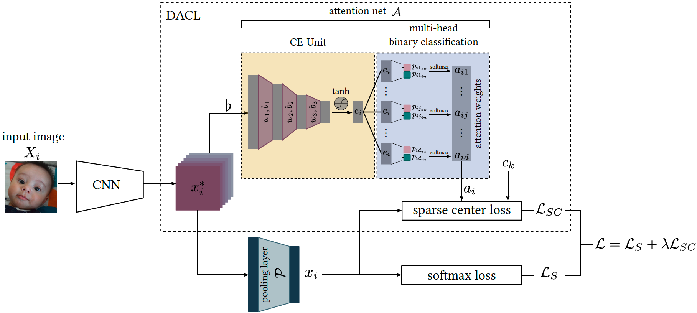

# DACL: Facial Expression Recognition in the Wild via Deep Attentive Center Loss
PyTorch training code and pretrained models for **DACL** (**D**eep **A**ttentive **C**enter **L**oss). We propose an attention network to adaptively select a subset of significant feature elements for enhanced facial expression discrimination. The attention network estimates attention weights across all feature dimensions to accommodate the sparse formulation of center loss to selectively achieve intra-class compactness and inter-class separation for the relevant information in the embedding space.

[](https://paperswithcode.com/sota/facial-expression-recognition-on-raf-db?p=facial-expression-recognition-in-the-wild-via)


DACL is highly customizable and can be adapted to other problems in computer vision. For more details see [Facial Expression Recognition in the Wild via Deep Attentive Center Loss](https://openaccess.thecvf.com/content/WACV2021/papers/Farzaneh_Facial_Expression_Recognition_in_the_Wild_via_Deep_Attentive_Center_WACV_2021_paper.pdf) by Amir Hossein Farzaneh and Xiaojun Qi (WACV2021).

# Model Zoo
We provide the trained DACL model and other baseline models with softmax loss and center loss in the future.
|   | method       | backbone | affectnet acc. | rafdb acc. | url \| logs | size |
|---|--------------|----------|:--------------:|:----------:|:-----------:|:----:|
| 0 | **DACL**         | resnet18 |     **65.20** %    |   **87.78** %  |     soon    |  NA  |
| 1 | center loss  | resnet18 |     64.09 %    |   87.06 %  |     soon    |  NA  |
| 2 | softmax loss | resnet18 |     63.86 %    |   86.54 %  |     soon    |  NA  |


# Usage

1. Install the required dependencies:
```bash
- torch == 1.5+
- torchvision == 0.6+
- scikit-learn
- tqdm
```

2. Download ms-celeb pretrained model for weight initialization: [Google Drive]([https://drive.google.com/file/d/1H421M8mosIVt8KsEWQ1UuYMkQS8X1prf/view?usp=sharing](https://drive.google.com/file/d/16uPBWtSfVOJvlxMnb0xg6sOP3-zhHsx3/view?usp=sharing))
3. clone this repository:
```bash
git clone https://github.com/amirhfarzaneh/dacl
```

## Data preparation
4. Download either [affectnet](http://mohammadmahoor.com/affectnet/) or [rafdb](http://www.whdeng.cn/RAF/model1.html) dataset and prepare the dataset folder structure as follows:

```
path/to/fer/dataset/
  train/  # directory containing training images
        00/ # subdirectory containing images from class 0 (neutral)
        01/ # subdirectory containing images from class 1 (happy)
        02/ # subdirectory containing images from class 2 (sad)
        ...
        06/ # subdirectory containing images from class 6 (disgust)
  valid/  # directory containing validation images
        00/ # subdirectory containing images from class 0 (neutral)
        01/ # subdirectory containing images from class 1 (happy)
        02/ # subdirectory containing images from class 2 (sad)
        ...
        06/ # subdirectory containing images from class 6 (disgust)
```
5. modify the dataset `root_dir` in `workspace.py` at [line 14](https://github.com/amirhfarzaneh/dacl/blob/304fe7ec16d5af63504d2415c6dd1bc96149950a/workspace.py#L14)

## Training
To train DACL initialized with **msceleb** weights on a single GPU for 10 epochs run:
```
python main.py --arch=resnet18 --lr=[LR] --wd=[WD] --bs=[BATCH-SIZE] --epochs=10 --alpha=[ALPHA] --lamb=[LAMBDA]
```

# Citation
If you use this code in your project or research, please cite using the following bibtex:
```
@InProceedings{Farzaneh_2021_WACV,
    author    = {Farzaneh, Amir Hossein and Qi, Xiaojun},
    title     = {Facial Expression Recognition in the Wild via Deep Attentive Center Loss},
    booktitle = {Proceedings of the IEEE/CVF Winter Conference on Applications of Computer Vision (WACV)},
    month     = {January},
    year      = {2021},
    pages     = {2402-2411}
}
```
